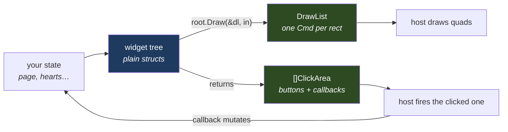
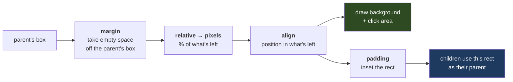
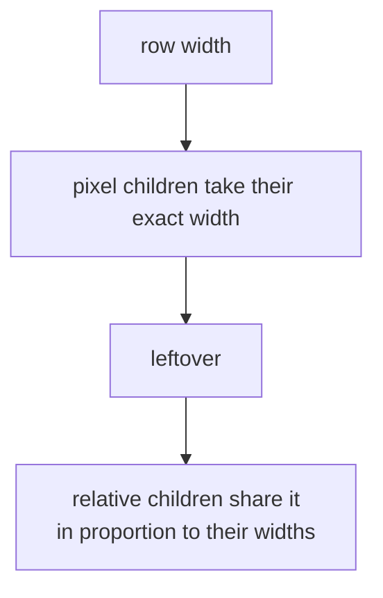
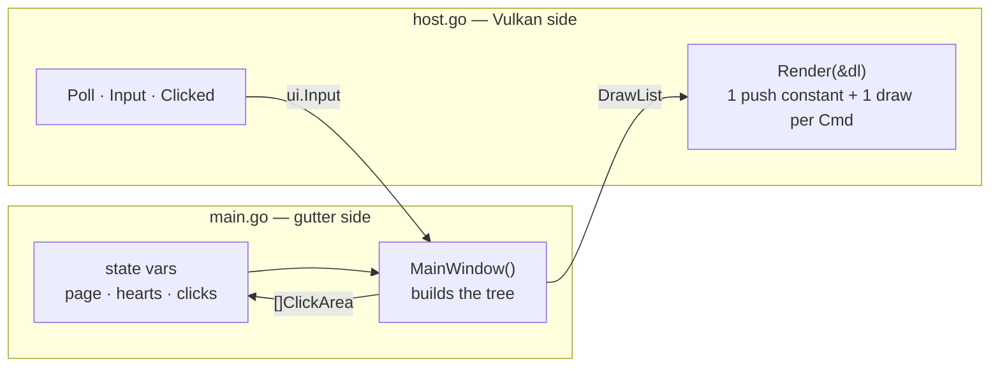

# How gutter works

You describe the UI as a tree of Go structs. You rebuild it every frame. gutter
turns it into a flat list of rectangles, and your renderer draws them.



gutter never touches a window or a GPU. All it takes in is `Input` (the cursor
and the viewport). All it gives back is the `DrawList` and the click areas.

---

## 1. The frame loop

```go
var dl ui.DrawList

for !host.ShouldClose() {
    host.Poll()
    in := host.Input()                    // cursor + viewport, framebuffer pixels

    dl.Reset()
    areas := buildUI().Draw(&dl, in)      // layout + emit, in one walk

    if host.Clicked() {                   // press edge, so a held button fires once
        for i := len(areas) - 1; i >= 0; i-- {   // last = drawn on top
            if a := areas[i]; a.Function != nil && ui.MouseInBounds(in, a) {
                a.Function()
                break
            }
        }
    }
    host.Render(&dl)
}
```

- **Rebuild the tree every frame** from your own variables. gutter keeps no
  widget state, so a callback changes your variables and the next frame shows
  the change.
- **Never call `Initialize` yourself.** `Draw` does it after reading the
  viewport from `in`.

## 2. Widgets

| widget | holds | draws |
|---|---|---|
| `Container` | one `Child` | its background: `Style.Color`, or `Image` stretched to fit |
| `Button` | one `Child`, `Function` | its background, plus hover feedback. **The only widget that is clickable** |
| `Row` / `Column` | `Children` | its background, with the children laid out left→right / top→bottom |
| `Text` | `Content`, `StyleText{Font, FontSize, FontColor}` | the string, left-aligned and vertically centred. `\n` starts a new line |

For hover, a `Button` swaps to `HoverImage` if it has one. Otherwise a
translucent dark quad is drawn over it. `Font` is a **path to a `.ttf`**. For
"no background", use a colour with alpha 0.

## 3. Layout

Each widget gets a `Properties{Size, Alignment, Margin, Padding}`.

| you write | means |
|---|---|
| `Size{ScalePixel, 56, 56}` | exactly 56×56 px |
| `Size{ScaleRelative, 30, 100}` | 30 % × 100 % of the parent |
| no `Size` | fill the parent (the root fills the window) |
| `Alignment: AlignmentTopLeft` | where to sit inside the parent (default: centre) |
| `Margin: SpacingEqual(ScalePixel, 8)` | 8 px of empty space **outside** the widget, taken from the parent's space before the widget is sized |
| `Padding: SpacingEqual(ScalePixel, 8)` | 8 px of space **inside** the widget: the background stays full size, the children are inset |

Every widget resolves itself the same way, from the outside in:



This is how CSS flexbox treats them. A margin never shrinks a widget's
background; it takes space from the parent. In a `Row` or `Column`, every
child's margins come out of the space first, and the siblings share what's
left. Three children at 33 % in a 600 px row, with a 10 px side margin on the
middle one, are each (600 − 20) / 3 wide. Padding then insets only the children.
Use `Margin` for gaps between siblings (the example's nav buttons) and
`Padding` to inset content in a coloured panel (the example's top bar).

### Row and Column split their space



Inside a row, relative widths act as **weights**: `30` and `70` split the
leftover space the same way `3` and `7` do. A relative child also fills the
row's full height. Children are packed from the left with no gaps, so use a
transparent relative `Container` as a **spacer** to push things apart. `Column`
is the same with the axes swapped.

```
Row: [56px heart][56px heart][56px heart][────── spacer (relative) ──────]
```

## 4. The output: `DrawList`

```go
type Cmd struct {
    Rect  Rect          // pixels, origin top-left, Y down
    Color color.NRGBA   // straight alpha; the fill, or the tint on Tex
    Tex   *Texture      // nil = solid rect
}
```

- Cmds are in **painter's order**: parents first, then children. Draw them in
  order with SrcAlpha / OneMinusSrcAlpha blending. No depth buffer needed.
- **A `Texture` keeps the same `Key` for the same content**, every frame. Upload
  it the first time you see the `Key`, and reuse it after that. Images are keyed
  by file path. Text is a white glyph bitmap tinted by `Color`, so recolouring a
  label is free.
- **Trap:** a label whose *text* changes every frame (a counter, a timer) makes
  a new texture every frame. Update it less often.

## 5. Writing a host

A host has four jobs:

1. Build `ui.Input`: cursor and viewport, both in the pixels you draw in. On
   HiDPI, scale the cursor from window units.
2. Draw each `Cmd` in order as a quad: `Color × texture`, straight-alpha blend.
3. Cache textures by `Texture.Key`. `Pixels.Pix` is tightly packed RGBA8.
   Sample with linear filtering and clamp-to-edge.
4. Hit-test the returned areas from last to first, and call `Function`.

`TreeHash(root)` changes whenever anything visible changes, if you only want to
redraw on change.

---

## 6. The example (`examples/vulkan`)

```sh
cd examples/vulkan && go run .   # needs ../../../go-vulkan checked out
```



### `main.go`: the UI

```
Column ─┬─ topBar     Row  11  [ title 30 │ subtitle 55 │ quit 15 ]
        ├─ body       Row  82  [ nav 22   │ content 56  │ gallery 22 ]
        └─ statusBar  Row   7  [ status 60 │ hint 40 ]
```

Each part shows one pattern you can copy:

| part | shows |
|---|---|
| `nav()` | one `Button` per page, built in a loop, with `Function: func() { page = i }`. A spacer keeps the buttons at the top |
| `heartRow()` | 56×56 pixel `Container`s with `Image`, then a spacer. Two PNG files, so two textures, however many hearts are drawn |
| `stepper` buttons | callbacks that change `hearts`. The next frame draws a different row |
| `boxModel()` (Layout page) | two lists of where this window uses margin (space between widgets) and padding (inner space to the edge), built from the named spacing variables. Below them, three same-size squares in one row: one with `Padding` (its colour frames an inset child), one with `Margin` (empty space around it pushes its neighbours away), one with neither. Under them, `loneMargins()`: three parents with one child each (fill, 50 %, 60 px), showing that with no siblings a margin is taken off the parent before the child sizes and centres itself |
| `gallery()` | the two hover styles: `HoverImage` swap vs. darkening quad |
| `statusBar()` | shows the previous frame's quad count, so the label doesn't change every frame |

The helpers that keep the tree readable:

- `label(text, size, colour, box)`: a `Text` inside a sized, transparent
  `Container`. This is how text gets a size in a row.
- `centeredLabel`: centres text by padding it, since `Text` has no alignment
  option.
- `stepper`: a fixed-size coloured button.
- `spacer(w, h)`: a transparent relative `Container`.
- `asset(name)`: a path relative to the repo root, so `go run .` works from
  anywhere.

### `host.go`: the renderer

- **One draw per `Cmd`.** The shader generates the quad's corners itself, so
  there is no vertex buffer. A 44-byte push constant carries the rect, the
  colour and a texture slot (`-1` = none).
- **Textures** go into a bindless array of 512 slots. `prepare` uploads each new
  `Key` once. After the first frames, nothing is uploaded.
- **UNORM swapchain** (`pickFormat`): gutter's colours are already sRGB bytes,
  so an sRGB swapchain would encode them twice.
- `Poll` turns the mouse button into a press edge and scales the cursor to
  framebuffer pixels.

The shaders (`shaders/ui.vert`, `ui.frag`) are about 30 lines each. Run
`go generate ./shaders` after editing them.

---

## Gotchas

- Always set `StyleText.Font`. The default, `"Arial"`, is not a file, so the
  text silently draws nothing.
- Only text is clipped. Other widgets can overflow their parent.
- `Center{0,0}` means "unset".
- The caches are plain maps, so build and draw the tree from one goroutine.

What's planned next (widget state, clip rects, fewer allocations) is in
`TODO.md`.
